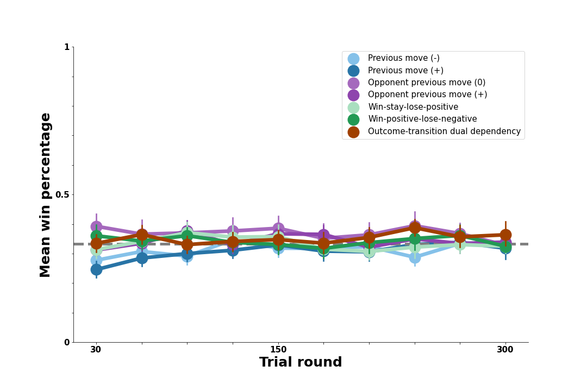
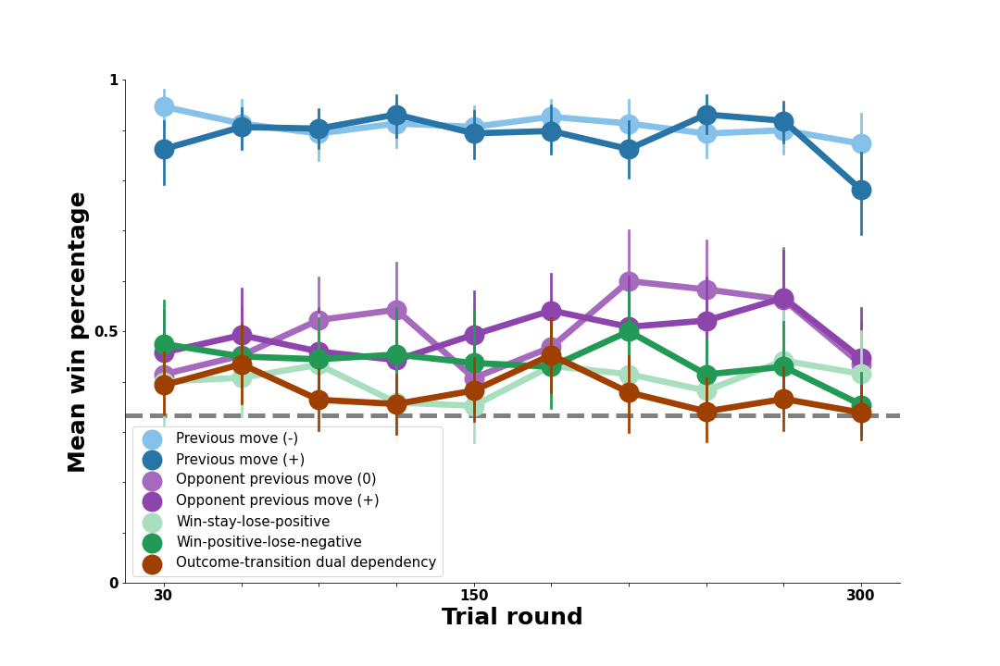
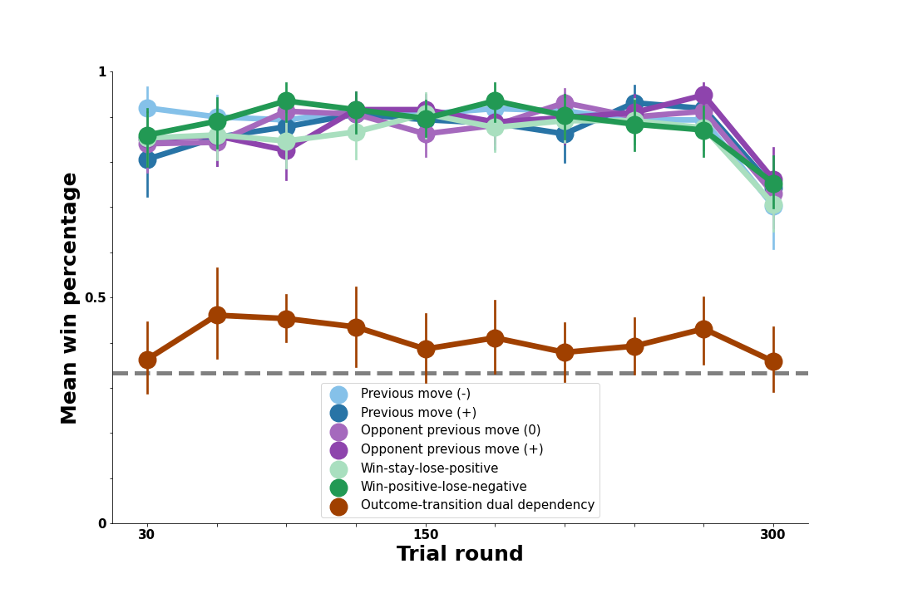
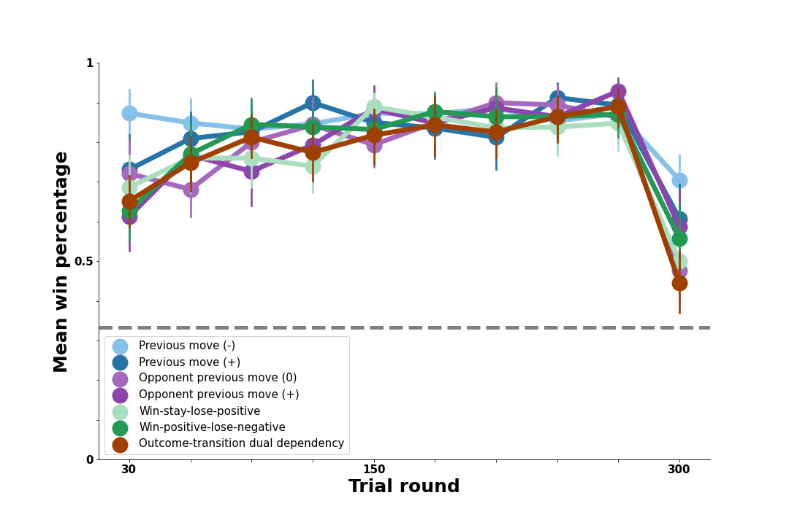

# Model Results

## Human performance: benchmark

**The above visualization demonstrates how human participants performed against bots which possessed unique strategies. The red dotted baseline indicates that the wining rate would be 33% if the participant did not exploit the perceivable patterns. The wining rate converges to the chance line as pattern of each bot becomes more complicated.**

## Null model: move base rates

**The above visualization showcases how the agent performs against the bots based on the simulation of softmax probabilities. Since it is an establishment of a base model, the agent outcomes converge around the chance line, which means that the agent has not taken the advantage of the sequential patterns in the bots yet.**

## Transition model: bot transitions only

**The graph above illustrates the simulation of agent's wining rate against bot transitions and grouped them into different bins. The agent does possess similar learning trends compare to those of humans. However, the learning rates against different bots are disparate between the agent and humans.**

## Transition model: bot Cournot transitions only

**This visualization captures the transition model in which the agent only focused on the cournot transitions. The cournot transitions indicate that the agent makes decisions based on its opponent's previous move instead of its own.The simulation did showcase that as the agent started exploiting the sequential patterns based on its opponent's previous move, its win percentage against bots that adopted corresponding strategies also increased.**

## Transition model: bot transitions + Cournot transitions

**The figure above entails the simulation in which the agent takes the advantage of the combination of bot transitions and cournot transitions. The generated win percentage illustrates that the agent was able to capture the sequential patterns of bots with repsective strategies. While the agent possesses an upward learning curve against some bots, its outcomes against the rest of the bots are around the chance line.** 

## Outcome-transition model: outcome-transitions only

**Model 5 simulates agent's win percentage in a context where the agent focuses solely on the outcome transition dual dependency bot. This is one of the most sophisticated bots because it favors a particular transition each round on the basis of of both the previous outcome and the previous transition it made. After running the simulation based on the softmax probability, we could see that the agent failed to exploit sequential patterns against such a bot, as its win percentage coverges around the chance line.**

## Dual-transition outcome model: complex strategy only

