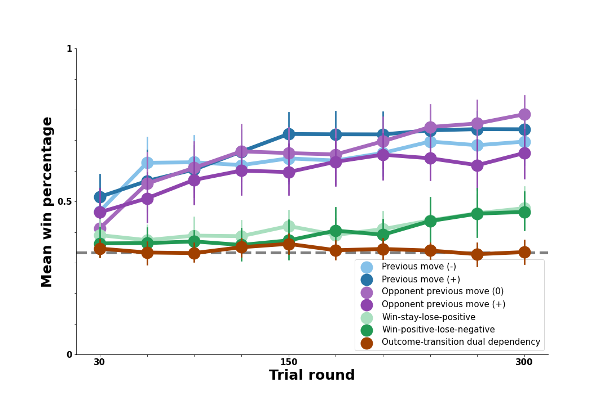

# Model Results

## Human performance: benchmark

**The above visualization demonstrates how human participants performed against bots which possessed unique strategies. The red dotted baseline indicates that the wining rate would be 33% if the participant did not exploit the perceivable patterns. The wining rate converges to the chance line as pattern of each bot becomes more complicated.**

## Null model: move base rates

**The above visualization showcases the mean win percentage of the reinforcement learning model before taking its previous winning rounds into consideration. Therefore, its results are gathered around the chance line and are not impacted by the complexities of the various bots.**

## Agent previous move reward

**The above visualization represents the scenario when the model determines its next move based on the combination of the human's past move and their current move. The model then generates the softmax distribution according to the reward counts of the previous combination.**

## Opponent previous move rewards

**The above visualization represents the scenario when the model determines its next move based on the combination of the opponent's past move and the human's current move. The model then generates the softmax distribution according to the reward counts of the previous combination.**

## Disjunctive agent, opponent previous move rewards

TODO: uncomment the below when it's ready
<!--  -->
