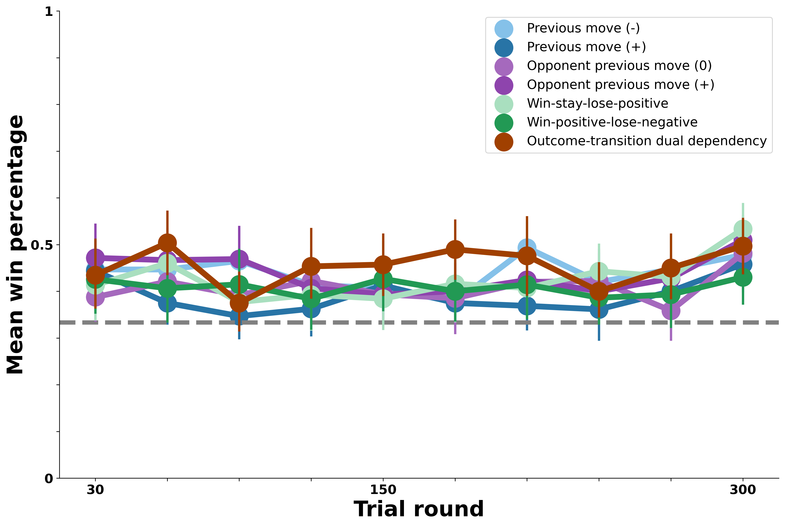
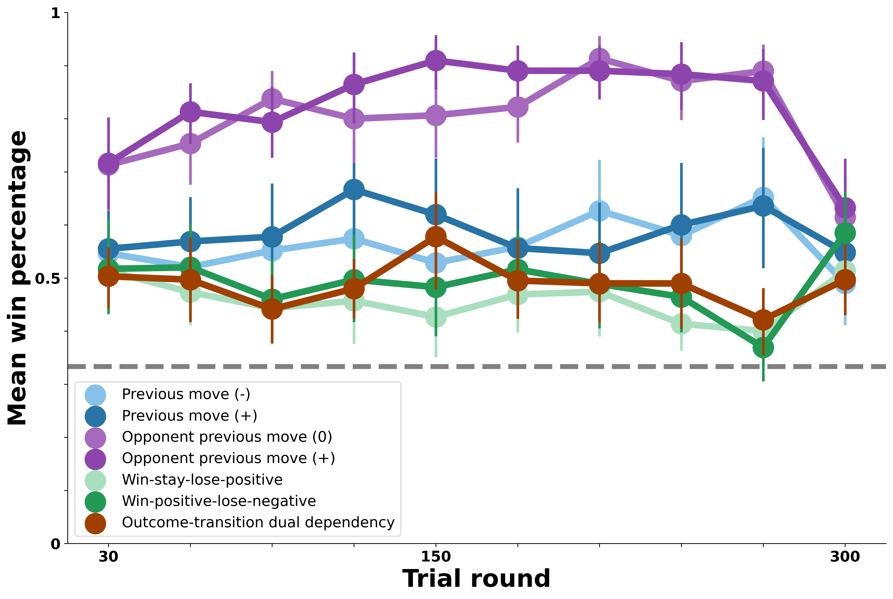

# Model Results

## Overview

As with the Model-Based Agent, we evaluate the success of the RL Agent model by comparing its decisions to human behavior in our experimental data. Here, we implement five distinct versions of the RL Agent that differ in the structure of contingencies they use to track previous rewards (see [Model Overview](RLModel.md)). In this way, the results shown here allow us to ask: **what kind of associative learning strategy best accounts for people's performance against the bot opponents?**

Once again, each version of the model simulates all of the games played by participants in our earlier experiment. We compare model versions based on their ability to capture the pattern of human win rates against the full range of bot opponents.

In the first section below, we show the human results against each bot (these are the same as in the Model-Based Agent results section). Then, we show simulation results for each version of the model.

## Model Benchmark: Human Performance

In the figure below, we show human performance against each of the bot opponents. On $y$, we plot average human win percentage against the bots in each block of 30 trials on $x$. The gray dashed line represents chance performance (33% win rate). Performance against each bot is shown in a different color, with bots that exhibit similar patterns in their own moves shown in similar colors (e.g., blue for self-transition bots, purple for opponent-transition bots, green for outcome-transition, and brown for the most complex dual-outcome-transition bot).

**The overall pattern of people's ability to exploit certain bot behaviors shown below is what we seek to capture with the different versions of our RL Agent.**

Our model comparisons below attempt to capture three central features of these results:
1. Against the bot opponents that exhibit simple *transition* patterns (blue and purple), people successfully learned to exploit these patterns and did so fairly rapidly.
2. Against the bot opponents whose transitions each round vary based on the previous *outcome* shown (green), people learn to exploit these opponents only in the last 100 rounds or so and don't perform nearly as well as they do against the transition opponents.
3. Against the most complex bot opponent (brown), people never perform above chance.

*How well can different versions of the RL Agent capture these empirical patterns?*

## *Null Model*: Reward Learning from Move Baserates

We first test a version of the RL Agent that chooses a move based on the rewards associated with each possible move (`Rock`, `Paper`, or `Scissors`). This represents a *null model* because none of the bots in the experiment could be reliably exploited merely by favoring a particular move.

As predicted, this model shows no ability to systematically beat any of the bot opponents the way people did; model win rates are close to chance and are not impacted by the complexities of the various bot opponents. However, the RL Agent can make use of richer past events to determine useful moves. We next consider several variants of the model that do just that.

## *Transition Model*: Reward Learning from Previous Moves

First, we consider a model that continually tracks the rewards associated with each possible choice of move given the previous move; this agent maintains cumulative rewards for `Rock` -> `Rock`, `Rock` -> `Paper`, etc. In each round, the agent uses the previous move of the *participant it is simulating* to narrow down the relevant set of cumulative rewards, then samples a move in proportion to its rewards given the previous move. The win percentages in the figure below are based on success of this learning strategy against each of the bot opponents.

Results show that learning rewarding associations between one's own previous moves and next move is highly successful against the *opponent-transition* bots who choose their next move precisely based on the human participant's previous move. Results suggest a modest advantage for tracking these associations against the other bot opponents as well. Thus, while such learning mechanisms may provide a plausible account of people's success against the opponent-transition bots, it does not do well enough against the self-transition bots and may be *too successful* against the more complex opponents that people struggled to exploit.

## *Transition Model*: Reward Learning from Opponent Previous Moves

We next test a version of the RL Agent that instead tracks rewards associated with each possible move given the *opponent's* previous move. This version is identical to the structure of the previous one, relying on the bot's previous move rather than the participant's to update cumulative rewards. In light of this, we expect a similar pattern of performance, where it will be most successful against the bots whose moves are determined by their own previous move.

**The above visualization represents the scenario when the model determines its next move based on the combination of the opponent's past move and the human's current move. The model then generates the softmax distribution according to the reward counts of the previous combination.**

## *Combined Transition Model*: Reward Learning from Self and Opponent Previous Moves

## *Disjunctive Transition Model*: Learning Separately from Self and Opponent Previous Moves

